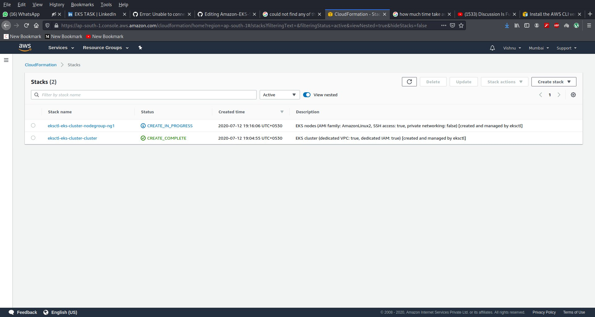

# Amazon-EKS-Service
### why we use Amazon EKS?

### Amazon EKS is a managed service that helps make it easier to run Kubernetes on AWS. Through EKS, organizations can run Kubernetes without installing and operating a Kubernetes control plane or worker nodes. Simply put, EKS is a managed containers-as-a-service (CaaS) that drastically simplifies Kubernetes deployment on AWS.

### Before going to task i create IAM user and give the full root access to it


```
apiVersion: eksctl.io/v1alpha5
kind: ClusterConfig
metadata:
  name: eks-cluster
  region: ap-south-1
nodeGroups:
- name: ng1
  desiredCapacity: 2
  instanceType: t2.micro
  ssh:
    publicKeyName: my_vpc

```
```
eksctl create -f create_cluster.yml
```




```
kind: Deployment
apiVersion: apps/v1
metadata:
  name: efs-provisioner
spec:
  selector:
    matchLabels:
      app: efs-provisioner
  replicas: 1
  strategy:
    type: Recreate
  template:
    metadata:
      labels:
        app: efs-provisioner
    spec:
      containers:
        - name: efs-provisioner
          image: quay.io/external_storage/efs-provisioner:v0.1.0
          env:
            - name: FILE_SYSTEM_ID
              value: fs-3d28a2ec
            - name: AWS_REGION
              value: ap-south-1
            - name: PROVISIONER_NAME
              value: eks-cluster/aws-efs
          volumeMounts:
            - name: pv-volume
              mountPath: /persistentvolumes
      volumes:
        - name: pv-volume
          nfs:
            server: fs-3d28a2ec.efs.ap-south-1.amazonaws.com
            path: /
```
   dfg
```
    ---
apiVersion: rbac.authorization.k8s.io/v1beta1
kind: ClusterRoleBinding
metadata:
  name: nfs-provisioner-role-binding
subjects:
  - kind: ServiceAccount
    name: default
    namespace: default
roleRef:
  kind: ClusterRole
  name: cluster-admin
  apiGroup: rbac.authorization.k8s.io
```
fff
```
kind: StorageClass
apiVersion: storage.k8s.io/v1
metadata:
  name: aws-efs
provisioner:  eks-cluster/aws-efs
---
kind: PersistentVolumeClaim
apiVersion: v1
metadata:
  name: efs-joomla
  annotations:
    volume.beta.kubernetes.io/storage-class: "aws-efs"
spec:
  accessModes:
    - ReadWriteOnce
  resources:
    requests:
      storage: 2Gi
---
kind: PersistentVolumeClaim
apiVersion: v1
metadata:
  name: efs-mysql
  annotations:
    volume.beta.kubernetes.io/storage-class: "aws-efs"
spec:
  accessModes:
    - ReadWriteOnce
  resources:
    requests:
      storage: 2Gi
          
```
   fff
```
   
 apiVersion: v1
kind: Secret
metadata:
  name: mysql-joomla
data:
  password: cmVkaGF0

 ```
 ff
 
 ```
   apiVersion: v1
  kind: Service
  metadata:
    name: ghost-mysql
    labels:
      app: ghost
  spec:
    ports:
      - port: 3306
    selector:
      app: ghost
      tier: mysql
    clusterIP: None
  ---
apiVersion: v1
kind: Service
metadata:
  name: joomla-mysql
  labels:
    app: joomla
spec:
  ports:
    - port: 3306
  selector:
    app: joomla
    tier: mysql
  clusterIP: None
---
apiVersion: apps/v1 # for versions before 1.9.0 use apps/v1beta2
kind: Deployment
metadata:
  name: joomla-mysql
  labels:
    app: joomla
spec:
  selector:
    matchLabels:
      app: joomla
      tier: mysql
  strategy:
    type: Recreate
  template:
    metadata:
      labels:
        app: joomla
        tier: mysql
    spec:
      containers:
      - image: mysql:5.6
        name: mysql
        env:
        - name: MYSQL_ROOT_PASSWORD
          valueFrom:
            secretKeyRef:
              name: mysql-joomla
              key: password
        - name: MYSQL_DATABASE
          value: joomla_db
        ports:
        - containerPort: 3306
          name: mysql
        volumeMounts:
        - name: mysql-persistent-storage
          mountPath: /var/lib/mysql
      volumes:
      - name: mysql-persistent-storage
        persistentVolumeClaim:
          claimName: efs-mysql
            
```
  ff
  ff
```
    
apiVersion: v1
kind: Service
metadata:
  name: joomla
  labels:
    app: joomla
spec:
  ports:
    - port: 80
  selector:
    app: joomla
    tier: frontend
  type: LoadBalancer
---
apiVersion: apps/v1 # for versions before 1.9.0 use apps/v1beta2
kind: Deployment
metadata:
  name: joomla
  labels:
    app: joomla
spec:
  selector:
    matchLabels:
      app: joomla
      tier: frontend
  strategy:
    type: Recreate
  template:
    metadata:
      labels:
        app: joomla
        tier: frontend
    spec:
      containers:
      - image: joomla
        name: joomla
        env:
        - name: JOOMLA_DB_HOST
          value: joomla-mysql
        - name: JOOMLA_DB_PASSWORD
          valueFrom:
            secretKeyRef:
              name: mysql-joomla
              key: password
        ports:
        - containerPort: 80
          name: joomla
        volumeMounts:
        - name: joomla-persistent-storage
          mountPath: /var/www/html
      volumes:
      - name: joomla-persistent-storage
        persistentVolumeClaim:
          claimName: efs-joomla
```

         
      
