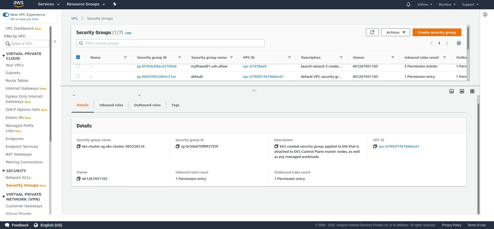
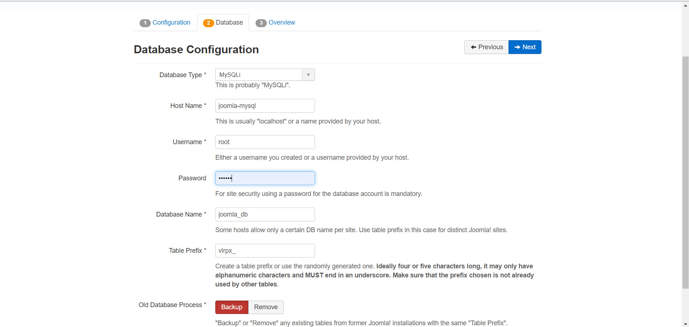

# Amazon-EKS-Service
### why we use Amazon EKS?

### Amazon EKS is a managed service that helps make it easier to run Kubernetes on AWS. Through EKS, organizations can run Kubernetes without installing and operating a Kubernetes control plane or worker nodes. Simply put, EKS is a managed containers-as-a-service (CaaS) that drastically simplifies Kubernetes deployment on AWS.
## CREATE IAM USER
### Before going to task i create IAM user and give the full root access to it

### After creating the IAM user just configure to aws cli so here i already add my user .


#### for launching the cluster download the eksctl command according to you system OS 
## CREATE A EKS CLUSTER USING Eksctl command
### Amazon will manage the k8s cluster master internally but for the slaves, we need to mention the configurations like how many instances we want as a slave and what should be the hardware configuration of that system ie Instance type.

### For Serverless Cluster we can go for the Fargate Profiles where we don't even require to tell the configuration about the salve node.
```
apiVersion: eksctl.io/v1alpha5
kind: ClusterConfig
metadata:
  name: eks-cluster
  region: ap-south-1
nodeGroups:
- name: ng1
  desiredCapacity: 2
  instanceType: t2.micro
  ssh:
    publicKeyName: my_vpc

```
```
eksctl create -f create_cluster.yml
```

### Then after cluster created , it might take almost 15-20 minutes as this code first contact to cloud formation, and cloud formation code is created for launching these resources from code and then the cluster is clustered and then the node groups are created.

### With cluster it is automatically start different Aws service like VPC,EIP subnet, security group 



### Here my ec2 intance (nodes) are launch , 

### Then we need to update the kubeconfig file for setting the current cluster details like the server IP, certificate authority, and the authentication of the kubectl so that client can launch their apps in that cluster using kubectl command.
```
aws eks update-kubeconfig --name <cluster name>
```
### Then its good practice to create a namespace and create your resources in that namespace ,  This help to Manage the our Pods.
```
kubectl create ns <namespace name>
```
### Our default namespace is default , so i want to change default namespace to  my new create namespace so i run below command
```
kubectl config set-context --current --namespace=<namespace name>
```
### Here i login to my all the cluster nodes and download utils for my efs service so that later on we can mount the EFS to those instances.So we need to login to those instances using the key, which we need to create before creating the cluster in the amazon management console under the Ec2 service section.
### To login to the instances, we can do ssh.
```
ssh -i  <key.pemfile>    -l   <username>  <Public Ip of  the instance>

yum install amazon-efs-utils -y      

```
### The efs-provisioner allows you to mount EFS storage as PersistentVolumes in kubernetes. It consists of a container that has access to an AWS EFS resource. The container reads a configmap which contains the EFS filesystem ID, the AWS region, and the name you want to use for your efs-provisioner.
## CREATE AN EFS PROVISIONER 
### But before creating the Efs- provisioner, create the EFS from where the pods will get the real storage.
### The efs-provisioner allows you to mount EFS storage as PersistentVolumes in kubernetes. It consists of a container that has access to an AWS EFS resource. The container reads a configmap which contains the EFS filesystem ID, the AWS region, and the name you want to use for your efs-provisioner.But before creating the Efs- provisioner, create the EFS from where the pods will get the real storage.


### Here i choose eksctl command created vpc so it auto attach subnet also .
### So it is compulsory that the Security group u attach to the Efs instances should be the same as that of the instances in which all nodes can connect to each other and all ports are allowed within that security group/s as we need the NFS service port number to be allowed in all the instance where the EFS needed to be mounted.
### Then while creating the manifest file for Efs provisioning we require the efs -id and the efs-DNS name. both are get from efs service crating after 
```
kind: Deployment
apiVersion: apps/v1
metadata:
  name: efs-provisioner
spec:
  selector:
    matchLabels:
      app: efs-provisioner
  replicas: 1
  strategy:
    type: Recreate
  template:
    metadata:
      labels:
        app: efs-provisioner
    spec:
      containers:
        - name: efs-provisioner
          image: quay.io/external_storage/efs-provisioner:v0.1.0
          env:
            - name: FILE_SYSTEM_ID
              value: fs-3d28a2ec
            - name: AWS_REGION
              value: ap-south-1
            - name: PROVISIONER_NAME
              value: eks-cluster/aws-efs
          volumeMounts:
            - name: pv-volume
              mountPath: /persistentvolumes
      volumes:
        - name: pv-volume
          nfs:
            server: fs-3d28a2ec.efs.ap-south-1.amazonaws.com
            path: /
```

## CREATE A CLUSTER ROLE BINDING FOR EFS PROVISIONER:

### Create a file, cluster role binding.YAML, that defines a cluster role binding that assigns the defined role to the service account.No alt text provided for this image
```
    ---
apiVersion: rbac.authorization.k8s.io/v1beta1
kind: ClusterRoleBinding
metadata:
  name: nfs-provisioner-role-binding
subjects:
  - kind: ServiceAccount
    name: default
    namespace: default
roleRef:
  kind: ClusterRole
  name: cluster-admin
  apiGroup: rbac.authorization.k8s.io
```


## CREATE THE STORAGE CLASS WITH PROVISIONER AS EFS PROVISIONER WHICH WE HAD CREATED :
### I created the storage class and the Pvc using the below manifest file
```
kind: StorageClass
apiVersion: storage.k8s.io/v1
metadata:
  name: aws-efs
provisioner:  eks-cluster/aws-efs
---
kind: PersistentVolumeClaim
apiVersion: v1
metadata:
  name: efs-joomla
  annotations:
    volume.beta.kubernetes.io/storage-class: "aws-efs"
spec:
  accessModes:
    - ReadWriteOnce
  resources:
    requests:
      storage: 2Gi
---
kind: PersistentVolumeClaim
apiVersion: v1
metadata:
  name: efs-mysql
  annotations:
    volume.beta.kubernetes.io/storage-class: "aws-efs"
spec:
  accessModes:
    - ReadWriteOnce
  resources:
    requests:
      storage: 2Gi
          
```
   
##  CREATE A SECRET FOR THE MYSQL_ROOT_PASSWORD AND JOOMLA_DB_PASSWORD
### FOR creating the secret here we use base64 encoder , you can use command line or some online encoder also use.
```
   
 apiVersion: v1
kind: Secret
metadata:
  name: mysql-joomla
data:
  password: cmVkaGF0

```
## NOW CREATE THE DEPLOYMENT FOR MYSQL AND THEN THE JOOMLA AS ALL THE DATA OF JOOMLA GOING TO BE STORED IN THE MYSQL 
### For env varible you can find the docker hub site here i use mysql 5.6 version use
```
kubectl create -f create_secret.yml
```
 
 ```

apiVersion: v1
kind: Service
metadata:
  name: joomla-mysql
  labels:
    app: joomla
spec:
  ports:
    - port: 3306
  selector:
    app: joomla
    tier: mysql
  clusterIP: None
---
apiVersion: apps/v1 # for versions before 1.9.0 use apps/v1beta2
kind: Deployment
metadata:
  name: joomla-mysql
  labels:
    app: joomla
spec:
  selector:
    matchLabels:
      app: joomla
      tier: mysql
  strategy:
    type: Recreate
  template:
    metadata:
      labels:
        app: joomla
        tier: mysql
    spec:
      containers:
      - image: mysql:5.6
        name: mysql
        env:
        - name: MYSQL_ROOT_PASSWORD
          valueFrom:
            secretKeyRef:
              name: mysql-joomla
              key: password
        - name: MYSQL_DATABASE
          value: joomla_db
        ports:
        - containerPort: 3306
          name: mysql
        volumeMounts:
        - name: mysql-persistent-storage
          mountPath: /var/lib/mysql
      volumes:
      - name: mysql-persistent-storage
        persistentVolumeClaim:
          claimName: efs-mysql
            
```
### The JOOMLA_DB_HOST value should be the same as that of the service name for the MYSQL_deployment ie in my case is Joomla-MySQL as we have mentioned the clusterIp:None so we can use the name of that servicer to establish the connection between the two pods in the same cluster.


### here i deploy my joomal and expose port 80 
```
    
apiVersion: v1
kind: Service
metadata:
  name: joomla
  labels:
    app: joomla
spec:
  ports:
    - port: 80
  selector:
    app: joomla
    tier: frontend
  type: LoadBalancer
---
apiVersion: apps/v1 # for versions before 1.9.0 use apps/v1beta2
kind: Deployment
metadata:
  name: joomla
  labels:
    app: joomla
spec:
  selector:
    matchLabels:
      app: joomla
      tier: frontend
  strategy:
    type: Recreate
  template:
    metadata:
      labels:
        app: joomla
        tier: frontend
    spec:
      containers:
      - image: joomla
        name: joomla
        env:
        - name: JOOMLA_DB_HOST
          value: joomla-mysql
        - name: JOOMLA_DB_PASSWORD
          valueFrom:
            secretKeyRef:
              name: mysql-joomla
              key: password
        ports:
        - containerPort: 80
          name: joomla
        volumeMounts:
        - name: joomla-persistent-storage
          mountPath: /var/www/html
      volumes:
      - name: joomla-persistent-storage
        persistentVolumeClaim:
          claimName: efs-joomla
```


### Some configuration before launch 



### login page open of joomla 


### For delete all environment we need only single command but here is only delete that resource they are create by eksctl command . like efs service we manualy delete 
```
eksctl delete cluster -f create_cluster.yml

```
 


### here can also use Fargate Profile for the Serverless Cluster.
### In the mumbai region this service my be not available 
```
 apiVersion: eksctl.io/v1alpha5
  kind: ClusterConfig

  metadata:
    name: fg-cluster
    region: us-east-1

  fargateProfiles:
    - name: fargate-default
      selectors:
       - namespace: kube-system
       - namespace: default
```
